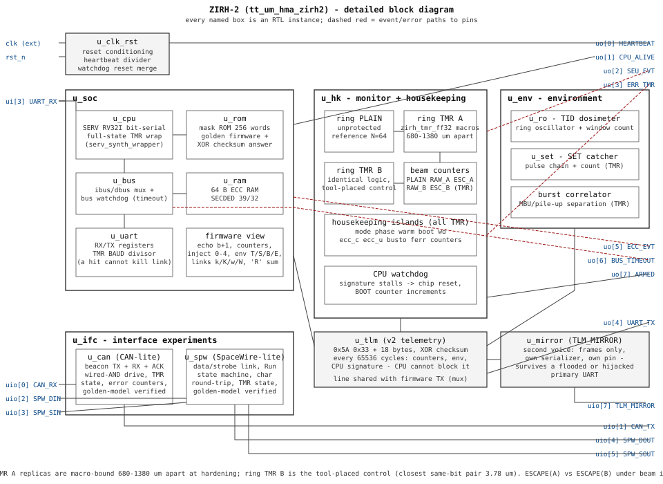

# ZIRH-2

**Radiation-Tolerant Experiment Chip 2: a computer under the beam**


> Successor to [ZIRH-1](https://github.com/Melihakbulut221/zirh). Where
> ZIRH-1 measures what radiation does to storage, ZIRH-2 measures
> whether a hardened computing element keeps executing - and which of
> its protections earn their area. IHP SG13G2 130 nm, 8x2 Tiny Tapeout
> tile.

## The two experiments

**Placement A/B.** ZIRH-1's layout analysis showed the placer clusters
TMR replicas of the same bit within 4-12 um of their shared voter - one
particle can defeat the vote. ZIRH-2 carries two identical TMR rings:
chain A's replicas are pre-hardened macros pinned 700/680/1380 um
apart; chain B is tool-placed on the same die. ESCAPE(A) vs ESCAPE(B)
in every telemetry frame prices placement separation in one number.

**The computer.** An unhardened SERV RISC-V (its crash rate is itself a
measurement) runs from an SEU-immune mask ROM, keeps state in SECDED
RAM with scrub-on-read, and proves its life every loop iteration with a
rolling signature the telemetry carries. The bus watchdog guarantees a
wedged peripheral costs an event, not the CPU.

## Block diagram



<details>
<summary>ASCII short form</summary>

```
                ui[3] UART_RX
                     |
  +-- clk_rst ---+   v
  | POR, ticks,  |  +------------- SoC --- (watchdog resets ONLY this) --+
  | HEARTBEAT ---|--| SERV RISC-V --ibus--> mask ROM (synthesized        |
  +--------------+  |  (bit-serial)         constants, pipelined fetch)  |
                    |      | dbus                                        |
                    |  bus + timeout --> ECC RAM (SECDED)                |
                    |      |         --> UART regs (commands, echo)      |
                    +------|---------------------------------------------+
                           | slot 3
         +-----------------+------------------+
         v                                    v
  +-- housekeeping hk ------------------+  +-- interfaces ifc ------+
  | PLAIN ring (N=32, the reference)    |  | CAN 2.0A-lite  uio[0:1]|
  | TMR ring A: 3 hard macros pinned    |  | SpaceWire-lite uio[2:5]|
  |   680-1380 um apart                 |  +------------------------+
  | TMR ring B: identical, tool-placed  |
  | RAW/ESC counters (all TMR),         |  +-- environment env -----+
  | CPU signature, BOOT, watchdog       |  | ring-osc TID sensor    |
  +----------------+-------------------++  | SET catcher chain      |
                   |          reads/arms|  | burst correlator       |
                   v                    +--+------------------------+
  +-- telemetry tlm2 (frames: all counters, signature, checksum) --+
  |     |                                                          |
  |     +--> UART TX mux ------------------------> uo[4] UART_TX   |
  |     +--> TLM_MIRROR (CPU-untouchable copy) --> uio[7]          |
  +----------------------------------------------------------------+

  diagnostics on uo[]: HEARTBEAT, CPU_ALIVE, SEU_EVT, ERR_TMR,
  ECC_EVT, BUS_TIMEOUT, ARMED - instrument vs computer failure
  visible on two LEDs with no software anywhere
```

</details>

The separation that matters: the watchdog reboots only the SoC, so the
instruments and both telemetry voices count straight through a CPU
death, and the BOOT field records it.

## Verified

Twenty-plus cocotb suites (integration through the TT harness at
silicon parameters, marathon and fault campaigns, and a systematic
gate-level SEU sweep - exhaustive singles plus the pair geometry that
maps the escape window, re-proven in CI on every hardening run),
synthesis integrity checks pinning every block's replica and flop
counts in BOTH directions - TMR that must survive, and the ECC RAM's
deliberate zero TMR. Hardened clean on the 8x2 die with the bound
macros: 83% utilization, setup +22 ns, hold positive at every corner,
DRC/LVS/antenna zero.

```sh
pip install -r test/requirements.txt
make -C test                  # integration via the TT harness
bash scripts/check_tmr.sh     # hardening survives synthesis, 10 checks
make -C fw                    # firmware (riscv-none-elf-, CI does this)
```

The mask ROM contents are committed as src/rom_init.vh, generated from
the CI firmware build - synthesis needs no toolchain and no parameter
plumbing.

## Documentation

- docs/info.md - datasheet: how it works, bench sequence
- docs/PINMAP.md - frozen pin map and its rationale
- docs/SCOPE.md - the engineering record: every sizing decision with
  the measurement that forced it, including the 8x2 probe that failed
  at 86% density and the shrink that fixed it
- docs/PREDICTION.md - the registered pre-beam prediction:
  ESCAPE(A) vs ESCAPE(B) from the escape window and the layout,
  frozen before any beam time
- docs/PAPER.md - manuscript draft built around that prediction

### The product program (docs/PROGRAM.md is the index)

The experiment chip is closed; docs/ROADMAP.md logs the product
program that followed. Design docs, each with its RTL or scripts:

- docs/PROGRAM.md - the obstacle register and the workstream plan
- docs/BOOT.md, docs/DEBUG-DFT.md, docs/ZIRH3-SCOPE.md - the
  dedicated-chip architecture: boot-from-MRAM, debug isolation and
  DFT, and the data-gated integration scope
- docs/BEAM-PLAN.md, docs/TID-SEL-PLAN.md, docs/DUT-BOARD.md,
  docs/FAULT-INJECTION-PLAN.md, docs/BENCH-PROCEDURE.md - the test
  ladder from bench glitching and laser TPA to the beam campaign,
  finished before any facility application
- docs/CORE-STUDY.md, docs/MPW-COST.md, docs/EXPORT-CONTROL.md - the
  product-chip decisions: core selection, the free-silicon path, and
  the export-control research memo
- docs/IP-PORTFOLIO.md, docs/CANARY-IP.md, docs/TMRGUARD-PRODUCT.md,
  docs/POSITIONING.md - what this program sells before any silicon:
  the IP catalogue, the drop-in radiation canary, tmr-guard as a
  product, and the open-evidence positioning
- docs/COMPLIANCE-MATRIX.md - the ECSS-shaped requirement/evidence
  matrix, generated from requirements.yaml and diffed in CI

## License

Apache-2.0. SERV is vendored unmodified from
[olofk/serv](https://github.com/olofk/serv) (pin in src/serv/VERSION).

---

*Like ZIRH-1: a research vehicle, not flight hardware. It is the chip
you build so that one day you know how to build that one.*
